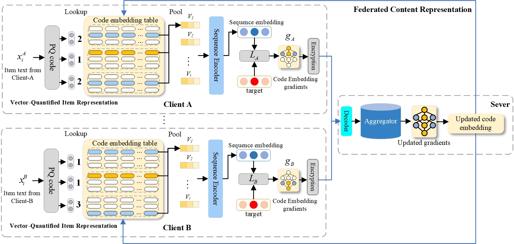

# PFCR

PyTorch implementation of the [paper](https://arxiv.org/abs/2401.14678).

> Lei Guo, Ziang Lu, Junliang Yu, Nguyen Quoc Viet Hung, Hongzhi Yin. Prompt-enhanced Federated Content Representation Learning
for Cross-domain Recommendation. TheWebConf 2024.



## Requirements

```
recbole==1.0.1
faiss-gpu==1.7.2
python==3.8.13
cudatoolkit==11.3.1
pytorch==1.11.0
```

## Dataset

We use the processed datasets from [UniSRec](https://github.com/RUCAIBox/UniSRec#download-datasets-and-pre-trained-model). You can download the processed dataset we used in the paper from [百度网盘](https://pan.baidu.com/s/1_32S8znijLWVTGZIdEe8XA?pwd=fbw8).


## Quick Start

### Data Preparation

Preparing item codes:

```bash
python all_pq.py --gpu_id 0
```


### Federated pre-train

```bash
python fed_pretrain.py
```
Before train, You need to modify the relevant configuration in the configuration files `props/VQRec.yaml` and `props/pretrain.yaml`. 

Here are some important parameters in `props/pretrain.yaml` you may need to modify:

1.`data_path`: The path of the dataset you want to use for pre-training.

2.`index_path`: The path of the item codes you want to use for pre-training. It is best to maintain consistency with the `data_path`.

3.`index_pretrain_dataset`: Here, it needs to be set as the abbreviation of the first letter you use to pre train two datasets. For example, if you use "Office-Arts", please write it as `OA` here.

Fine-tune pre-trained recommender of "Office-Arts":

```bash
python single_train.py --d=OA --p=your_pretrained_model.pth
```

You also need to modify the `index_pretrain_dataset` in `props/finetune.yaml` to the abbreviation of the first letter of the current single dataset. The `pq_data` is consistent with the `index_pretrain_dataset` in `props/pretrain.yaml`.
### Prompt-finetune

Prompt finetune pre-trained recommender of "Office-Arts":

```bash
python prompt_finetune.py --d=OA --p=your_pretrained_model.pth
```
You need to adjust the `props/prompt.yaml` in the same way as adjusting the `props/finetune.yaml`.
In the `model\`, we also provide different prompt models for you to choose from. 
